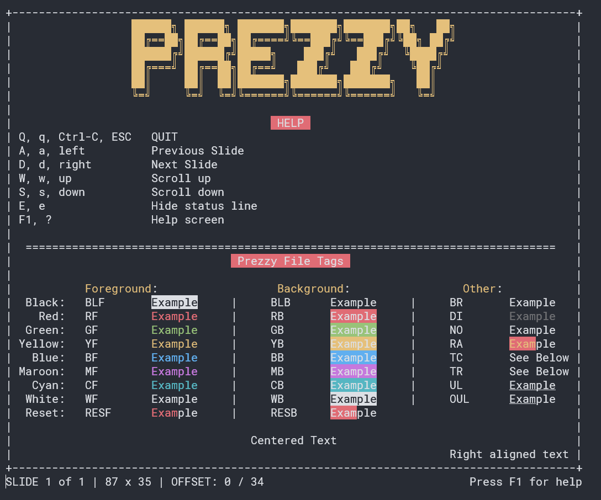

# Prezzy

A no-dependency, sort-of okay, terminal presentation app.



## Usage

Run Prezzy with Python like so:

`$ python prezzy.py <prez file>`

While Prezzy is running here are the commands you can use:

```
Q, q, Ctrl-C, ESC   QUIT
A, a, left          Previous Slide
D, d, right         Next Slide
W, w, up            Scroll up
S, s, down          Scroll down
E, e                Hide status line
F1, ?               Help screen
```

## Writing a Prez File

In the spirit of sort-of okay-ness Prezzy supports tags to help make your life
easier.


```
          Foreground:    Background:    Other:
 Black:   \BLF        |  \BLB        |  \BR : Bright Text
   Red:   \RF         |  \RB         |  \DI : Dim Text 
 Green:   \GF         |  \GB         |  \NO : Normal Text
Yellow:   \YF         |  \YB         |  \RA : Reset All
  Blue:   \BF         |  \BB         |  \TC : Text Center
Maroon:   \MF         |  \MB         |  \TR : Text Right
  Cyan:   \CF         |  \CB         |  \UL : Underline
 White:   \WF         |  \WB         |  \OUL : Reset Underline
 Reset:   \RESF       |  \RESB
 ```

## Gotta love a good list

- Add in key names so we can use those instead of their ordinal values
- Move everything into a class
- Add support or OSes besides Windows.